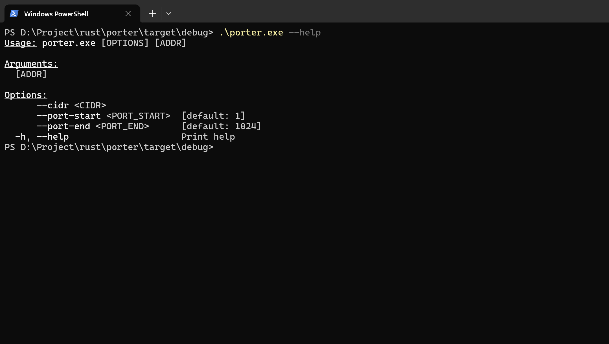
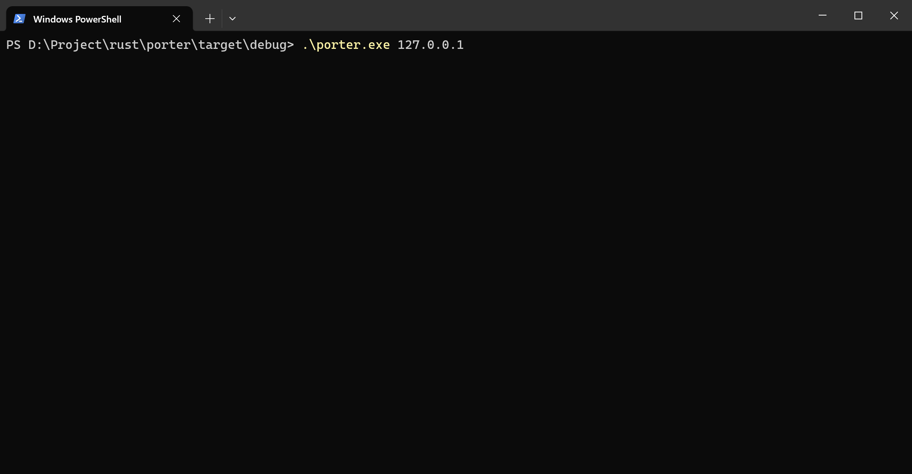

# porter

## 简介

一个使用Rust编写的端口扫描工具

## 编译

```shell
cargo build
```

## 查看配置项

可以使用如下`--help`参数来查看所有配置项

```shell
./porter.exe --help
```



## 使用

```shell
./porter.exe 127.0.0.1
```

或

```shell
./porter.exe --cidr 127.0.0.0/24
```

